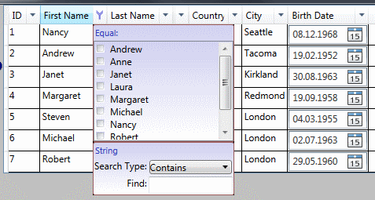

## Немного предыстории
### Предпосылки для использования
При создании пользовательского интерфейса бизнес-приложения  на основе WPF
одним из самых полезных и часто используемых элементов является нативный `DataGrid` из сборки *PresentationFramework.dll*.
`DataGrid` выводит в табличной форме данные из запроса или коллекции, предоставляя пользователю возможность 
настраивать внешний вид таблицы: изменять ширину столбцов и высоту строк, порядок вывода столбцов 
и порядок сортировки строк. Однако, в нативной реализации нет возможности фильтрации строк 
по содержимому. Эта функция доступна, например, в таблицах Excell и довольно востребована пользователями.

Допустим, в форме потребовалось реализовать быстрый поиск и фильтрацию в свойстве "Адрес" по подстроке, введенной пользователем. 
Для реализации быстрого фильтра потребуется:
- подготовить поле для ввода пользователем условия фильтрации 
(например, подстроку для поиска), 
- при изменении значения поля в коде передать новое значение в функцию фильтрации,
- в представлении коллекции, отображаемой в `DataGrid`, настроить фильтрацию 
и вызвать процедуру обновления представления.

Если такой фильтр требуется для каждого столбца, отображаемого в `DataGrid`, это становится проблемой, 
эффективно решаемой библиотекой *ItemsFilter*.

Для включения быстрого фильтра по столбцам `DataGrid` достаточно добавить в проект ссылку на библиотеку *ItemsFilter.net6.dll*,
а в ресурсах приложения добавить стиль "ItemsFilterStyle.xaml", после чего все `DataGrid` в Ваших формах 
будут выглядеть так, как на *рис.1*. Содержимое отображаемого столбца и подходящие для него фильтры 
распознаются автоматически при подключении коллекции к `DataGrid`.

### Детали реализации.
Для вывода коллекции данных обычно используются такие элементы, как `ListBox`, `ListView`, `DataGrid` 
и другие производные от `ItemsControl` элементы. Привязка к коллекции производится через свойство `ItemsControl.ItemsSource`.
При указании коллекции в качестве источника привязки `ItemsControl` не выполняет прямую привязку к коллекции. 
Вместо этого `ItemsControl` фактически привязывается к представлению коллекции по умолчанию `CollectionViewSource`, 
являющейся прокси-сервером класса `CollectionView`. `CollectionView` предоставляет `ItemsControl` возможности группирования,
сортировки, фильтрации и перемещения по переданной в конструктор коллекции данных без её изменения.

Класс `ItemsFilter.FilterPresenter` выполняет роль менеджера, управляющего подключением управляемых фильтров 
к `CollectionViewSource.View` и передачей изменений состояния подключенных к коллекции фильтров 
в функцию фильтрации `CollectionViewSource.Filter`.
Для получения экземпляра класса `FilterPresenter` в коде вызывается функция `FilterPresenter.Get(source)`. Созданные
экземпляры кешируются, так что при повторном вызове функции для того же экземпляра *source* будет возвращен 
созданный ранее для этого экземпляра `FilterPresenter`.

При инжекции быстрого фильтра в `DataGrid` или другой производный от `ItemsControl` элемент управления 
для коллекции извлекается `FilterPresenter`, после чего экземпляр `FilterPresenter` создает экземпляры управляемых фильтров
(реализаций класса `ItemsFilter.Model.Filter`) и подключает их к коллекции. Созданные экземпляры
привязываются к представлениям фильтра `FilterView`, отображаемым в форме.

### Область использования
*ItemsFilter* можно использовать для быстрого отбора в коллекциях, отображаемых классом `CollectionViewSource` 
в представление, допускающее фильтрацию. Наиболее полезный и частый сценарий использования - подключение 
к наследующим от `ItemsControl` элементам пользовательского интерфейса возможностей быстрого отбора (фильтрации).

Лучший способ увидеть предоставляемые библиотекой *ItemsFilter* возможности — 
скомпилировать и запустить пример приложения ***Nortwind.Sample.net6***. 
В примере приложения на нескольких формах показаны приёмы внедрения быстрой фильтрации в форму 
и отражены возможности, предоставляемые библиотекой `ItemsFilter`. Детали реалицации для каждого из приёмов внедрения описаны
в соответствующих разделах документации.

[Оглавление](Readme.md) >>
[Вперед](Examle1.EmployeesView.md "Использование готового элемента управления FilterDataGrid (EmployeesView)")

