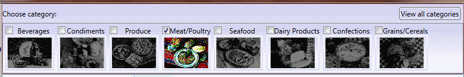

### Настройка view для фильтра. (ProductsView)
Разумеется, представление view для модели `Filter` можно настраивать любым образом. 
Более того, модель `Filter` может отображаться в UI в нескольких `Control` одновременно. 
В форме *ProductsView.xaml* элемент управления `CategoryFilterView` по сути дела является 
`MultiValueFilterView`, которому назначен индивидуальный стиль, но моделью представления для него 
является тот же самый экземпляр `EqualFilter`, который включен в состав фильтров столбца
*Category* для `DataGrid`.

Так выглядит`CategoryFilterView`:

А так — `DataGrid:CategoryColumnFilter`:

Обратите внимание, что при изменении фильтра в одном из представлений 
автоматически изменяется другое представление, так что состав отображаемых категорий 
всегда одинаков, как и всегда одинаково состояние кнопки очистки фильтра. 
Здесь применен приём [повторного извлечения модели фильтра](Examle4.ProductsView.md "Использование представления коллекции c фильтром в нескольких местах. (ProductsView)") 
для представления коллекции.

[Назад](Examle2.CategoriesView.md "Внедрение в DataGrid через стиль (CategoriesView)") <<
[Оглавление](Readme.md) >>
[Вперед](Examle4.ProductsView.md "Использование представления коллекции c фильтром в нескольких местах. (ProductsView)")