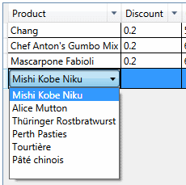

### 4.	Использование представления коллекции c фильтром в нескольких местах. (ProductsView)

Для дальнейшего изучения возможностей библиотеки *ItemsFilter* необходимо небольшое пояснение. 
Центральный класс библиотеки, `FilterPresenter`, равно как и модели фильтров Filter(s), 
которые он применяет для фильтрации, не взаимодействуют с `DataGrid`, `ItemsSelector` или `ItemsControl`.
Вместо этого они работают с представлением коллекции, подключенным к экземпляру `FilterPresenter`
при его создании. А уж представление коллекции мы можем использовать там, где нам необходимо
— возможно, во множестве мест одновременно. Если при инициализации `FilterPresenter` мы передаем 
не представление коллекции, а непосредственно саму коллекцию, то используется экземпляр 
представления коллекции по умолчанию (и он един для данного экземпляра коллекции во всем приложении). 
Аналогичным образом производные от `ItemsControl` элементы управления подключают коллекцию 
при установке свойства `ItemsControl.ItemsSource`. Таким образом, для взаимодействия `FilterView` 
и `ItemsControl` достаточно, чтобы они оба были подключены к одному экземпляру коллекции 
(или одному представлению коллекции).  

В иллюстрациях предыдущей главы в форме *ProductsView.xaml* элемент управления `CategoryFilterView` находится вне `DataGrid`,
но управляет отображением коллекции, которую выводит `DataGrid`.

#### Как использовать
File *ProductsView.xaml*:
``` xaml
    ...
    <DataGrid x:Name="productDataGrid"
                      ItemsSource="{Binding Path=Products,
                                            Source={StaticResource Workspace}}">
    ...
```
File *CategoryFilterView.xaml.cs*:
``` c#    
    public partial class CategoryFilterView: MultiValueFilterView {
        public CategoryFilterView() {
            InitializeComponent();
            // Define Filter that must be use.
            EqualFilterInitializer initializer = new EqualFilterInitializer();
            // Get FilterPresenter that connected to the same collection Workspace.This.Products.
            FilterPresenter productsCollectionViewFilterPresenter = 
                FilterPresenter.TryGet(Workspace.This.Products);
            // Get EqualFilter that use Category item property.
            EqualFilter filter = 
                ((EqualFilter)(productsCollectionViewFilterPresenter.TryGetFilter("Category", initializer)));
            // Use instance of EqualFilter as Model.
            Model = filter;
        }
    }
```
#### Как это работает
Экземпляр `FilterPresenter` всегда привязан к представлению коллекции, для которого он создан. 
Поскольку в свойстве `DataGrid.ItemsSource` мы указываем непосредственно на саму коллекцию, 
`DataGrid` извлекает и использует представление коллекции по умолчанию. При получении экземпляра 
`FilterPresenter` в вызов `FilterPresenter.TryGet(Workspace.This.Products)` также передается 
непосредственно коллекция, и привязка происходит к тому же самому экземпляру представления коллекции 
по умолчанию. По сути дела, `CategoryFilterView` может находиться даже в отдельном окне – 
фильтрация представления коллекции влияет на все элементы, использующие это представление. 

В форме *OrdersView.xaml* в раскрывающемся списке выбора *Product* повторно используется представление коллекции
по умолчанию для `Workspace.This.Products`, поэтому при активном фильтре в форме `ProductsView`
в режиме редактирования ячейки `Product` формы  *OrdersView.xaml* в ниспадающем списке элемента
управления `ComboBox` отображаются только отфильтрованные элементы. 

Например, для состояния фильтра, приведенного в предыдущей главе, вид ниспадающего списка при редактировании 
столбца *Product* формы  *OrdersView.xaml* будут выведены только продукты из категории Meat/Poultry:



[Назад](Examle3.ProductsView.md "Настройка внешнего вида фильтра. (ProductsView)") <<
[Оглавление](Readme.md) >>
[Вперед](Examle5.OrdersView.md "Фильтрация элементов в пользовательском элементе управления. (OrdersView)")
