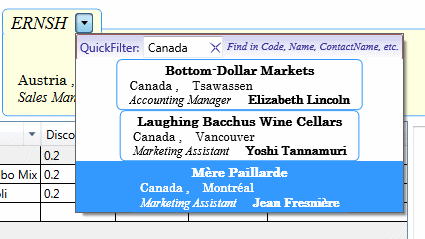

### 6.	Фильтрация элементов в ComboBox. (OrdersView)
В форме `OrdersView` клиент в заказе можно выбирать с помощью раскрываемого списка 
элемента управления `ComboBox`. Это удобно, но клиентская база фирмы *Northwind* обширна,
и оператору требуется средство быстрого поиска по списку: по наименованию фирмы, 
по имени контактного лица, по местоположению. С библиотекой *ItemsFilter* это несложно.

#### Что потребуется в коде
Создаем пару классов – специализированный фильтр `CustomersComboBoxFilter` 
и его инициализатор `CustomersComboBoxFilterInitializer`:

File *CustomersComboBoxFilter.cs*:
``` c#
    [View(typeof(StringFilterView))]
    // Define specialized filter for CustomersComboBox.
    public sealed class CustomersComboBoxFilter: StringFilter, IFilter {
        private static StringBuilder sb = new StringBuilder();
        internal CustomersComboBoxFilter()
        // To search for combine the values of several properties.
            : base(item => 
            {
                Customer customer = (Customer)item;
                sb.Clear();
                sb.Append(customer.City);
                sb.Append(',');
                sb.Append(customer.Code);
                sb.Append(',');
                sb.Append(customer.ContactName);
                sb.Append(',');
                sb.Append(customer.Country);
                sb.Append(',');
                sb.Append(customer.Name);
                sb.Append(',');
                sb.Append(customer.Region);
                return sb.ToString();
            }) {}
    }
```
File *CustomersComboBoxFilterInitializer.cs*:
``` c#
    class CustomersComboBoxFilterInitializer:FilterInitializer {
        public override BolapanControl.ItemsFilter.Model.Filter NewFilter(
                FilterPresenter filterPresenter, 
                object key) {
            if (key != null && 
                filterPresenter.CollectionView.SourceCollection is IEnumerable<Customer>) {
                	return new CustomersComboBoxFilter();
                }
            return null;
        }
    }
```
В шаблон элемента управления `ComboBox` вносим вновь созданный фильтр и  привязываем его к `ItemsSource`:

File *CustomerComboBoxStyle.xaml*:
``` xaml
    <Style x:Key="ComboBoxStyle" TargetType="{x:Type ComboBox}">
            <Setter Property="Template">
                <Setter.Value>
                    <ControlTemplate TargetType="{x:Type ComboBox}">
                        <Grid x:Name="MainGrid" SnapsToDevicePixels="true">
                    ...
                    <bsFilter:FilterControl Key="CustomerAnyFieldFilter"
                                     ParentCollection="{TemplateBinding ItemsSource}">
                        <bsFilter:FilterControl.Resources>
           	            <Style BasedOn="{StaticResource CustomerComboBox_StringFilterStyle}" 
				            TargetType="{x:Type bsFilter:StringFilterView}" />
                        </bsFilter:FilterControl.Resources>
                        <bsFilter:FilterControl.FilterInitializersManager>
                            <bsFilter:FilterInitializersManager>
                                    <vm:CustomersComboBoxFilterInitializer />
                            </bsFilter:FilterInitializersManager>
                        </bsFilter:FilterControl.FilterInitializersManager>
                    </bsFilter:FilterControl>
                    ...
```
Настраиваем отображение фильтра через стиль `СustomerComboBox_StringFilterStyle`.
Готово.
#### Как использовать
В форме подключаем полученный стиль к элементу `ComboBox`.
Файл *OrdersView.xaml*:
``` xaml
    <ComboBox x:Name="customerComboBox"
       ItemsSource="{Binding Customers,
                                    Source={StaticResource Workspace}}"
              SelectedItem="{Binding Customer,
                                     Converter={StaticResource NullToUnsetValueConverter}}"
              Style="{DynamicResource ComboBoxStyle}" />
```
#### Как это выглядит


[Назад](Examle5.OrdersView.md "Фильтрация элементов в пользовательском элементе управления. (OrdersView)") <<
[Оглавление](Readme.md) >>
[Вперед](Examle7.CustomersView.md "Фильтрация элементов в TreeView. (CustomersView)")
