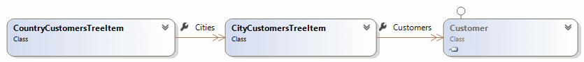
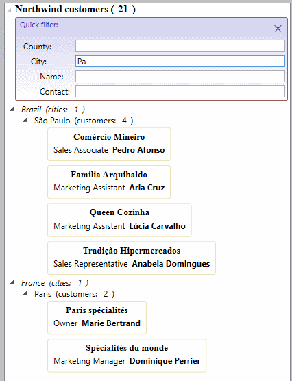

### 7.	Фильтрация элементов в TreeView. (CustomersView)
Форма *CustomersView.xaml* отображает в `TreeView` результаты запроса к таблице `Customers`.
`TreeView`  имеет 2 уровня группировки (по странам и по городам) и форму быстрой фильтрации.

Результат запроса возвращается в виде перечисления элементов `CountryCustomersTreeItem`,
имеющих вложенные коллекции:

#### Что потребуется в коде
Определяем класс `CustomersTreeFilterInitializer` и группу связанных фильтров - 
см. файлы в папке *Nortwind.Sample.net6/View/CustomersTreeFilter*.

В форме *CustomersView.xaml* в шаблоне для `TreeView` добавляем элемент управления `FilterControl` 
и устанавливаем для него созданный инициализатор фильтра `CustomersTreeFilterInitializer`:
``` xaml
    <bsFilter:FilterControl Key="Country"
                            Grid.Row="1"
                            Grid.Column="1"
                            Margin="3"
                            ParentCollection="{TemplateBinding ItemsSource}">
        <bsFilter:FilterControl.FilterInitializersManager>
            <bsFilter:FilterInitializersManager>
                <vw:CustomersTreeFilterInitializer/>
            </bsFilter:FilterInitializersManager>
        </bsFilter:FilterControl.FilterInitializersManager>
    </bsFilter:FilterControl>
```
Готово.
#### Результат:

#### Как это работатет
`FilterControl`, включенный в состав шаблона, служит для фильтрации как в исходной коллекции,
возвращенной запросом, так и во вложенных коллекциях 
(свойства `CountryCustomersTreeItem.Cities` и `CityCustomersTreeItem.Customer`). Для управления 
исходной и вложенными коллекциями создается три класса фильтров – `CountriesTreeFilter`, 
`CitiesTreeFilter` и `CustomersTreeFilter` – по одному на каждый уровень фильтрации. 
Моделью представления фильтра является экземпляр класса  `CountriesTreeFilter`. 
При подключении коллекции `CountriesTreeFilter` выполняет перечисление экземпляров 
`CountryCustomersTreeItem` и формирует фильтры для каждой коллекции элементов
`CityCustomersTreeItem`, переданной в свойстве `Cities`. Ссылки на полученные фильтры 
сохраняются для передачи условий фильтра и формирования функции фильтрации *IsMatch*. 
Аналогичная работа производится на уровне экземпляров фильтра `CitiesTreeFilter`.

[Назад](Examle6.OrdersView.md "Фильтрация элементов в ComboBox. (OrdersView)") <<
[Оглавление](Readme.md) >>
[Вперед](Summary.md "О библиотеке. Кратко и по существу")