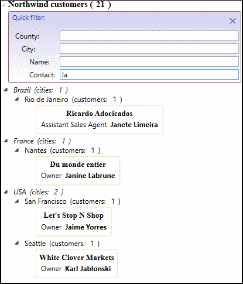

## Несколько примеров

Несколько примеров, как могут выглядеть стандартные элементы управления с возможностью быстрой фильтрации.

**DataGrid.**
В заголовок стандартного контрола `DataGrid` добавляется кнопка быстрой фильтрации по содержимому колонки 
(примерно так, как это можно выполнять в Excel или в стандартном проводнике Windows в режиме таблицы):

Инжекция производится через стиль: достаточно добавить в проект ссылку на библиотеку *ItemsFilter.net6.dll*, 
а в ресурсах приложения добавить стиль "ItemsFilterStyle.xaml", после чего все `DataGrid` в Ваших формах 
будут выглядеть так, как на *рис.1*. Содержимое отображаемого столбца и подходящие для него фильтры 
распознаются автоматически при подключении коллекции к `DataGrid`.

Так же легко можно добавлять контролы для быстрого фильтра и в остальные элементы, 
наследующие от `ItemsControl`: `ListBox`, `ComboBox`, `TreeView`, `TollBar`, `StatusBar` и т.д.

Например, вот так может выглядеть `ComboBox`:

или `TreeView`:

Лучший способ изучить предоставляемые библиотекой *ItemsFilter* возможности — 
скомпилировать и запустить пример приложения ***Nortwind.Sample.net6***. 
В приложении на нескольких формах показаны приёмы внедрения быстрой фильтрации в форму 
и отражены возможности, предоставляемые библиотекой `ItemsFilter`.

Дальнейшие темы раскрывают каждый из примеров внедрения быстрой фильтрации в форму.

[Оглавление](Readme.md) >>
[Введение](ALittleBackground.md "Немного предыстории: Предпосылки для использования. Детали реализации.")

